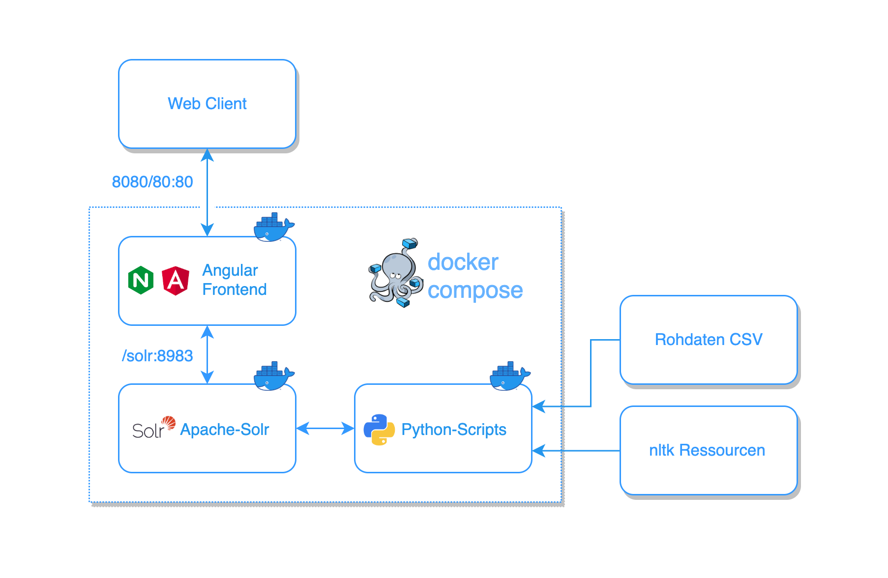

Angular & Solr on Docker
========================

This is a simple example project using Angular and Apache Solr in a dockerized environment as follows:

During initialization, the *Python-Scripts* container will download the raw data from the
[German Summarization Challenge](https://www.swisstext.org/swisstext.org/2019/shared-task/german-text-summarization-challenge.html) (100k text/summary pairs) and index
all texts in a Solr core.

Before you run the application, make sure you have [Docker Compose](https://docs.docker.com/compose/) installed on your computer. 
Then, to run the application, simply type from within the project's directory:
    
    $ docker-compose up
    
Note: Since indexing all 100k documents would take a considerable amount of time (due to various preprocessing such as POS-Tagging, etc.) only 1'000 documents
are indexed per default. If you would like to index another amount of documents, change the *max_docs* argument in the [docker-compose.yml](docker-compose.yml) file.
