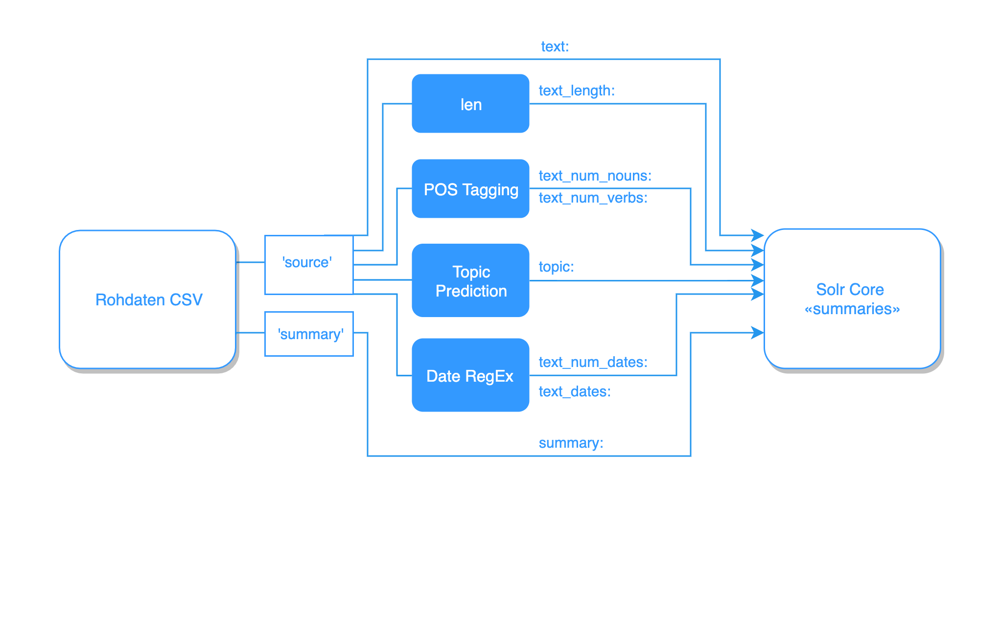

Daten und Feature-Engineering
=============================
Der Index wird wie eingangs beschrieben mit Daten der «German Text Summarization Challenge 2019» aufgebaut.
Der Datensatz umfasst 100'000 Texteinträge mit jeweils zugehöriger, manuell redigierter Zusammenfassung.
Der Datensatz hat entsprechend eine sehr einfache Struktur:

.. csv-table:: Struktur der CSV-Datei des Datensatzes
    :file: ../tables/train.csv
    :widths: 70,30
    :header-rows: 1
    :encoding: utf-8

Wie vorgängig erwähnt, sollen das Preprocessing, also die Normalisierung und das Feature Engineering und schliesslich die Indexierung der Dokumente automatisch und reproduzierbar ablaufen.
Folgende Grafik gibt einen Überblick über den Datenfluss:

    Datenfluss von Rohdokument bis Index.
    Neben den bereits vorhandenen Feldern *source* und *summary* werden weitere Felder über Feature-Engineering indexiert.

Nebst den im Datensatz vorhandenen Feldern *source* sowie *summary* (Volltext und Zusammenfassung), werden diverese weitere Felder
via Feature-Engineering indexiert, um den Anforderungen des Auftraggebers zu genügen. Die Einzelnen Prozesse sind nachfolgend
im Detail beschrieben.

Einstieg in den automatischen Ablauf bildet das Modul *scripts/__main__.py*.

.. _scripts/__main__.py: https://github.com/samuelblattner/dockerized-angular-solr-example/blob/master/scripts/__main__.py

Datumsangaben
-------------
Der Datensatz besteht ausschliesslich aus Texten in deutscher Sprache.
Daher können Datumsangaben in einfacher Weise gefunden werden.
Um die Formate *dd.mm.yyyy* sowie *dd.M.yyyy* in den Texten zu finden, wird folgende Regular Expression verwendet:

.. code-block::

    (\d{1,2}\.\s?(\d{1,2}\.\s?|\s?(Januar|Februar|März|April|Mai|Juni|Juli|
    August|September|Oktober|November|Dezember))(\s?\d{4}))

Davon wird einerseits die Anzahl pro Text im Feld *text_num_dates* und andererseits die effektiven Daten im Feld *text_dates* indexiert.
Für das Parsen von Daten in Textformat wird die Bibliothek dateparser_ verwendet.
Das Datum wird im Format *yyy-mm-dd* an solr übergeben.

.. _dateparser: https://pypi.org/project/dateparser/

Part-Of-Speech Tagging
----------------------
Die NLP-Bibliothek Spacy_ analysiert Textdaten mit wenig Aufwand.
Unter vielen anderen steht die Funktion «Part-Of-Speach» Tagging («POS-Tagging») zur Verfügung, mit der die Wortarten von Texten annotiert werden:

.. literalinclude:: ../../../scripts/__main__.py
    :language: python
    :lines: 136
    :linenos:

Zur schnelleren Verarbeitung werden die Texte stapelweiseweise an Spacy (nlp-Objekt) übergeben.
Ausserdem werden die Bestandteile *parser* (Abhängigkeiten von Satzteilen), *ner* (Named Entity Recognition, erkennen von referenzierten Objekten, z.B. Orte, Menschen, etc.) sowie
*textcat* (Textkategorisierung) ausgeschaltet, um den Prozessor von nicht benötigten Berechnungen zu entlasten.
Für die Textkategorisierung wird ein eigenes Modell trainiert (siehe weiter unten).

Mit der vorgängig beschriebenen Extraktion von Datumsangaben sowie mit POS-Tagging wird Anforderung Nr. 5 entsprochen.

.. _Spacy: https://spacy.io/

Topic Modeling
--------------
Der Datensatz enthält Texte aus verschiedenen Sachgebieten.
Die Themen sind jedoch nicht im Datensatz enthalten und müssen erzeugt werden.
Dafür wird ein «Topic Model» auf Basis der Non-negative-Matrix-Factorization-Methode (NMF) trainiert.

Die Texte werden zunächst normalisiert:

.. literalinclude:: ../../../scripts/topic_model/utils.py
    :language: python
    :lines: 27-39
    :linenos:

Bei diesem Prozessschritt wird ein Text jeweils nach Leerzeichen getrennt und in einzelne Wörter zerlegt (Zeile 5).
Anschliessend werden die Wörter zur Reduktion der Dimensionalität bzw. der Komplexität des Datenmodells mit einem SnowballStemmer auf ihre Stämme reduziert (Zeile 7).
Schliesslich werden alle Wörter entfernt, die aus nur einem Zeichen bestehen.

Im nächsten Prozessschritt werden die Dokumente vektorisiert.
Der *CountVectorizer* baut einerseits aus den in den Texten enthaltenen Wörtern ein Vektoren-Vokabular auf und verwendet dieses wiederum
bei der Umwandlung der Dokumente:

.. literalinclude:: ../../../scripts/topic_model/create_topic_model.py
    :language: python
    :lines: 19-33
    :linenos:

Mit diesem Vokabular bzw. den vektorisieren Dokumenten wird schliesslich das Modell trainiert:

.. literalinclude:: ../../../scripts/topic_model/create_topic_model.py
    :language: python
    :lines: 35-44
    :linenos:

Das «unsupervised learning» gruppiert Wörter für 20 Themen bereits in brauchbarer Weise.
Die aus einem Code-Beispiel entnommenen Parameter *min_df* (minimale Dokumentfrequenz) sowie *max_df* für den *CountVectorizer* sind
für den vorliegenden Datensatz allerdings nicht passend bzw. bewirken die Selektion von zu vielen Wörtern, die in das Vokabular einbezogen werden.
Ein Vektor des Vokabulars besteht aus 177'468 Komponenten und macht das Modell unnötig komplex.
Der *CountVectorizer* wird deshalb so angepasst, dass nur Wörter mit einer minimalen Documentfrequenz von 200 in das Vokabular aufgenommen werden.
Gleichzeitig wird die maximale Documentfrequenz gesenkt von 0.6 auf 0.2.
Bei einem Korpus von 100'000 Dokumenten entspricht dies einem minimalen Vorkommen eines Wortes in 0.2% sowie einem maximalen Vorkommen von 20% aller Dokumente.
Damit sollte die Qualität bzw. die Aussagekraft der einzelnen Wörter verbessert werden.
Ein Erneutes Training des Vokabulars erzeugt Wortvektoren mit noch 16'464 Komponenten.
Die folgende Tabelle zeigt die erzeugten Wort-Cluster gemäss den erwähnten Parametereinstellungen:

.. csv-table:: Topics
    :file: ../tables/topics1.csv
    :widths: 4,48,48
    :header-rows: 1
    :encoding: utf-8
    :class: longtable

Zwar sind die Wort-Cluster in den beiden Parametereinstellungen relativ ähnlich.
Allerdings kristallisiert sich bei bestimmten Themen wie z.B. Nr. 9 eine deutlich bessere Auswahl heraus.
Möglicherweise liesse sich diese zur Anpassen der Parameter sogar noch weiter verbessern.
Undeutliche Cluster wie z.B. Nr. 19 fallen hingegen weg.

Um einen weiteren Anhaltspunkt zur Benennung der Themen zu erzeugen, wird für jeden Cluster jeweils dasjenige Dokument gesucht,
bei dem das entsprechende Thema dominiert und bei dem das Dokument die höchste Score erreicht.
Gleichzeitig wird manuell jeweils ein Themavorschlag hinzugefügt:

.. csv-table:: Topics
    :file: ../tables/best_fits.csv
    :widths: 5,20,30,45
    :class: longtable
    :header-rows: 1
    :encoding: utf-8
    :align: left

Das so trainierte Modell kann nun dazu verwendet werden, für beliebige Texte ein dominirendes Thema zu prognostizieren:

.. literalinclude:: ../../../scripts/topic_model/infer_topic_model.py
    :language: python
    :lines: 50-57
    :linenos:

