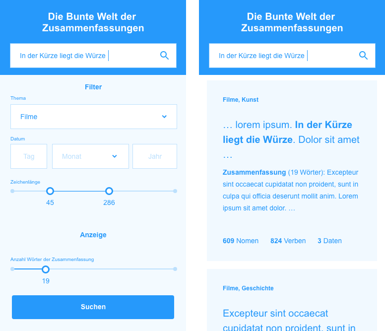

UI and Demo
===========
Für das User Interface wurde ein einfaches Wireframe erzeugt, das die Hauptfunktionen um den Suchfilter zeigt.
Neben der Volltextsuche über das erste Eingabefeld (Anforderungen Nr. 2 und 6), können Resultate
mit dem darauffolgenden Dropdown nach Themen gefiltert werden (Anforderung Nr. 8).
Im darauf folgenden Eingabefeld kann ein einzelnes Datum festgelegt werden, das in den Suchresultaten vorkommen soll (Anforderung Nr. 7).
Mit dem Doppelschieber können Texte nach ihrer Anzahl Zeichen gefiltert werden.
Dafür lässt sich eine Unter- und Obergrenze einstellen (Anforderung Nr. 4).
Schliesslich kann die Anzahl ausgegebener Wörter der Zusammenfassung festgelegt werden (Anforderung Nr. 1).
Wie bereits erwähnt wird hierbei die Goldstandard-Zusammenfassung verwendet.
Ein Modell für abstrahierende Zusammenfassungen zu erstellen und zu trainieren liegt ausserhalb des Zeitbudgets.

Pro Resultat werden jeweils die beiden zutreffendsten Themen, der gefundene Textausschnitt, die Zusammenfassung sowie die Anzahl Nomen, die Anzahl Verben und die Anzahl der Datumsangaben angezeigt (Anforderung Nr. 5).

    Wireframes für das UI

Zur Umsetzung des Frontends wird das Angular-Framework verwendet.

