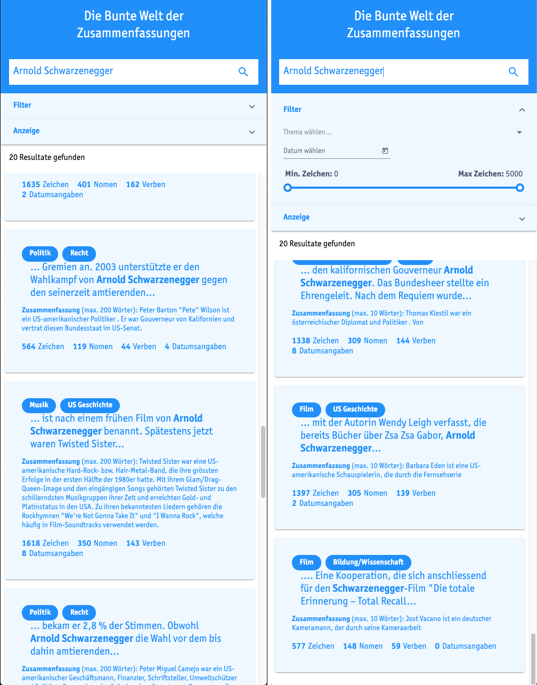
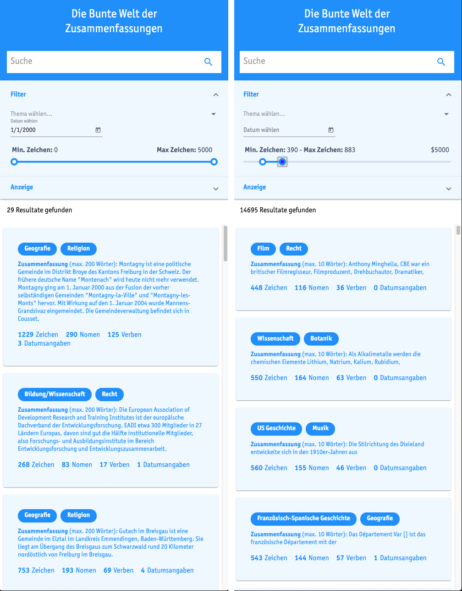
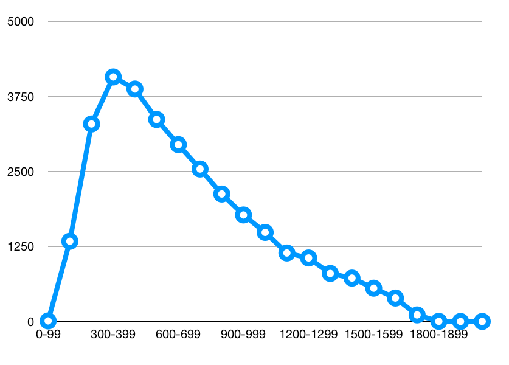

Demo und Weiterentwicklungsmöglichkeiten
========================================

Die gesamte Applikation lässt sich sehr einfach und schnell auf jedem Computer, der mit Docker bzw. *docker-compose* ausgestattet ist, einrichten.
Dazu muss zunächst das Repository (https://github.com/samuelblattner/dockerized-angular-solr-example) heruntergeladen und die Applikation anschliessend mit dem Befehl *docker-compose up* gestartet werden.
Standardmässig werden nur 1'000 Dokumente indexiert, da das Indexieren des gesamten Datensatzes bis zu 2 Stunden in Anspruch nehmen kann.

Abbildung 2 zeigt die Volltextsuche, bei der nach *Arnold Schwarzenegger* gesucht wird.
Die Resultate werden jeweils nach BM25-Ähnlichkeit sortiert, wobei das Resultat mit dem höchsten Wert
zuerst erscheint.
In der rechten Hälfte von Abbildung 2 ist sodann auch ersichtlich, dass die Suche nach *Arnold Schwarzenegger*
ohne Anführungszeichen zu verwenden auch Resultate findet, in denen nur eines der beiden Wörter enthalten ist.
Diese Resultate erscheinen aber aufgrund des geringeren Ähnlichkeitswertes am Ende der Liste.

Dieses Beispiel zeigt ausserdem, dass das Topic-Model mehr oder minder brauchbare Klassifizierungen liefert.
So können die Resultate über die Person Arnold Schwarzenegger nach dem gewünschten Kontext (Film, Politik, Musik, ...) gefiltert werden.

Abbildung 3 zeigt die Funktion des Datumsfilters.
Der Filter wird mit dem Datum 1.1.2000 aktiviert.
Der Volltext hinter dem ersten Resultat enthält die Datumsangabe «1. Januar 2000» (zufälligerweise wird diese
Angabe auch in der Zusammenfassung verwendet).
Daten werden also beim Preprocessing korrekt erkannt und als Datumsobjekte indexiert, sodass sie unabhängig ihrer Formatierung gefunden werden können.

Nicht zuletzt zeigen die Beispiele auch den Textlängenfilter und die Funktionstüchtigkeit der Zeichen-, Datumsangaben- sowie Wortartzähler.

    Volltextsuche

    Datumssuche und Textlängenfilter

Die Applikation könnte so erweitert werden, dass das von Solr implementierte Faceting zur Anwendung kommt.
So könnte beispielsweise auf einfache Weise eine Statistik bzw. ein Diagramm zu den im Datensatz vorhandenen Textlängen erstellt werden:
Wird das *text_length*-Feld z.B. nach 100er Intervallen facetiert, wird folgendes Resultat zurückgeliefert:

.. code-block:: json

    "facet_counts":{
        "facet_queries":{},
        "facet_fields":{},
        "facet_ranges":{},
        "facet_intervals":{
          "text_length":{
            "[0,100)":9,
            "[100,200)":1335,
            "[200,300)":3288,
            "[300,400)":4071,
            "[400,500)":3870,
            "[500,600)":3363,
            "[600,700)":2944,
            "[700,800)":2538,
            "[800,900)":2122,
            "[900,1000)":1773,
            "[1000,1100)":1483,
            "[1100,1200)":1140,
            "[1200,1300)":1057,
            "[1300,1400)":799,
            "[1400,1500)":722,
            "[1500,1600)":554,
            "[1600,1700)":390,
            "[1700,1800)":109,
            "[1800,1900)":2,
            "[1900,2000)":0,
            "[2000,2100)":0}},
        "facet_heatmaps":{}}}

Dargestellt als Histogramm könnte so ansatzweise eine links-schiefe Normalverteilung erkannt werden:

